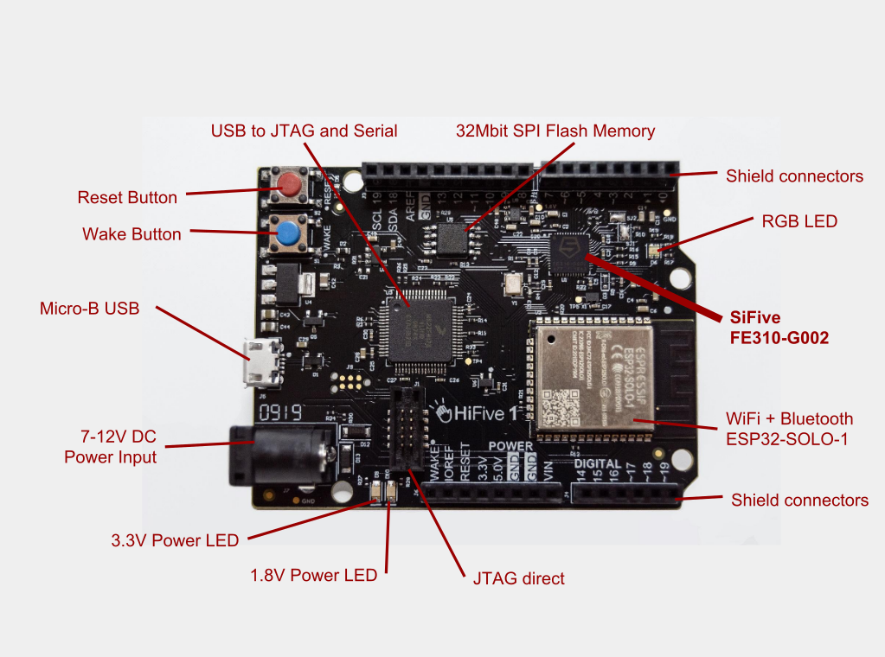
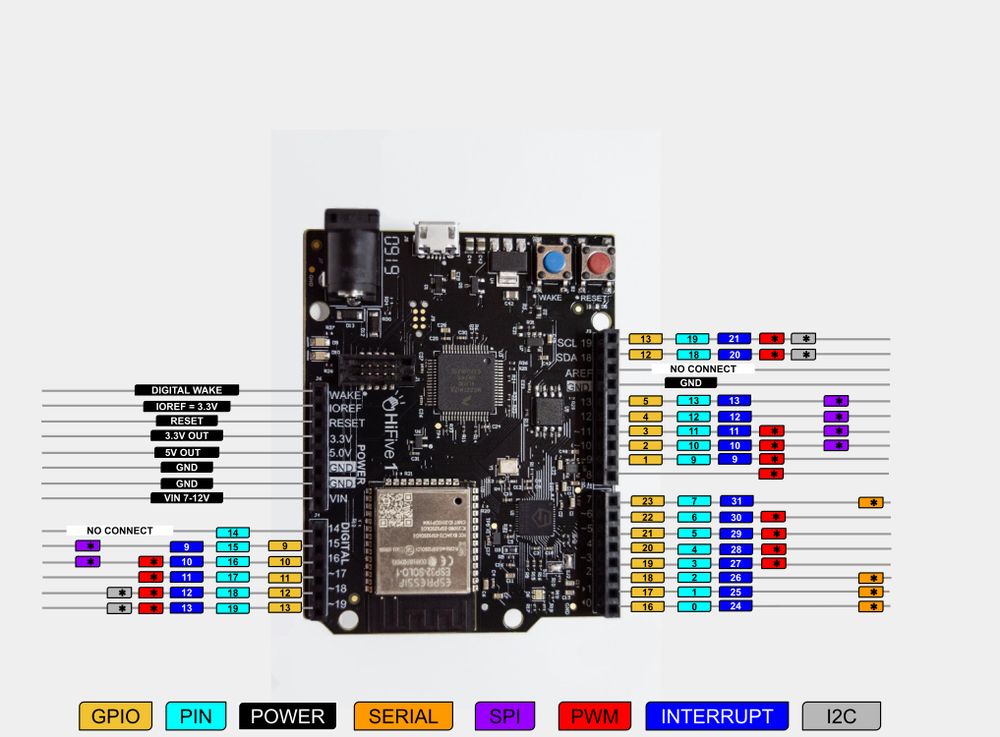
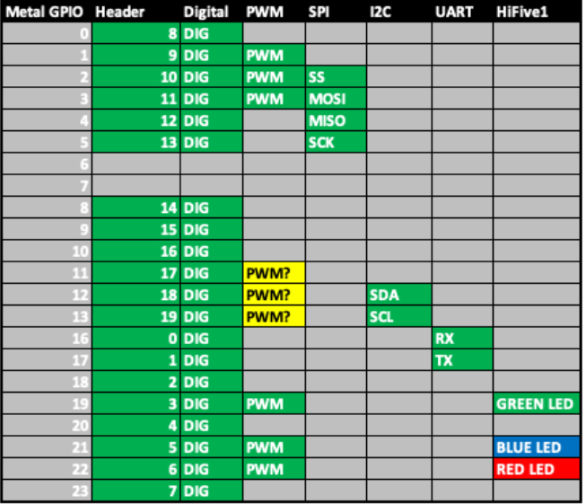

# HiFive1 Rev B

## **Table of Contents**
1. [Introduction](#1-introduction)  
2. [Board Overview](#2-board-overview)  
3. [Key Components and their Roles](#3-key-components-and-their-roles)  
   - [FE310-G002 SoC (RISC-V Processor)](#fe310-g002-soc-risc-v-processor)  
   - [ESP32 (WiFi & Bluetooth Module)](#esp32-wifi--bluetooth-module)  
   - [QSPI Flash (External Storage)](#qspi-flash-external-storage)  
   - [Power Supply Circuitry](#power-supply-circuitry)  
   - [Debug Interface (J-Link & UART Debugging)](#debug-interface-j-link--uart-debugging)  
4. [Setting Up Development Environment](#4-setting-up-development-environment)  
   - [Required Tools](#required-tools)  
   - [Installation](#installation)  
     - [Segger J-Link OB Debugger](#segger-j-link-ob-debugger)  
     - [PlatformIO](#platformio)  
5. [Note on Freedom Studio](#5-note-on-freedom-studio)  
6. [Contribution Guide](#6-contribution-guide)  
7. [License](#7-license)  

---

## 1. Introduction
The **HiFive1 Rev B** board from **SiFive** is an **open-source RISC-V development board** built around the **SiFive FE310-G002** processor. This readme file serves as a **complete, beginner-friendly guide** to understanding the **key components, interfacing peripherals, and development workflow** for the HiFive1 Rev B.

## 2. Board Overview
The HiFive1 Rev B is a **32-bit RISC-V microcontroller** designed for embedded and IoT applications. It includes:

- **FE310-G002 RISC-V SoC** (Freedom Everywhere 310)
- **ESP32 for WiFi & Bluetooth**
- **GPIO, SPI, UART, I2C, PWM, ADC support**
- **Onboard J-Link Debugger**
- **Arduino-compatible GPIO pin headers**
- **QSPI Flash for firmware storage**

<div align="center">
  
  <p><b>Fig 1:</b> Hifive Rev1b board</p>
</div>


## 3. Key Components and their Roles
### **FE310-G002 SoC (RISC-V Processor)**
- **Core:** 32-bit RISC-V CPU (RV32IMAC) running at 320+ MHz
- **Memory:** 16KB L1 Instruction Cache, 8KB Data SRAM
- **Peripherals:**
  - **GPIO:** 32 General Purpose I/O
  - **SPI:** QSPI Flash interface
  - **UART:** Serial Communication
  - **I2C:** Two-wire communication
  - **PWM & ADC:** For motor control & sensor input

### **ESP32 (WiFi & Bluetooth Module)**
The **ESP32-SOLO-1** module is included for **wireless communication**.
- **Communication Interface:** SPI/UART
- **WiFi** (802.11 b/g/n) and **Bluetooth** (BLE 4.2)
- **Boot Mode:** Controlled via **GPIOs**
- **Reset Circuitry:** Controlled via a **dedicated WF_RESET signal**
- **Power Supply:** 3.3V LDO regulator

### **QSPI Flash (External Storage)**
- **Used for storing firmware & bootloader**
- **Interfaced via SPI with FE310-G002**
- **Supports up to 16MB of flash memory**

### **Power Supply Circuitry**
- **5V Input via USB**
- **3.3V LDO Regulator for Core & Peripherals**
- **Power-on Reset (POR) circuit for stable boot**
- **ESP32 also runs on 3.3V**

### **Debug Interface (J-Link & UART Debugging)**
- Onboard J-Link Debugger for **real-time debugging & programming**
- USB-to-UART bridge for **serial communication & logging**

## 4. Setting Up Development Environment
### **Required Tools**
- **PlatformIO** (Recommended) or **Freedom Studio**
- **Segger J-Link OB Debugger**

### **Installation**
#### **Segger J-Link OB Debugger**
1. Download from the [Segger website](https://www.segger.com/downloads/jlink/#J-LinkSoftwareAndDocumentationPack).
2. Install using:
   ```bash
   sudo dpkg -i JLink_Linux_V*.deb
   ```
3. Verify installation:
   ```bash
   lsusb | grep -i segger
   ls /dev/ttyACM*
   ```
4. Connect to HiFive1 Rev B’s console:
   ```bash
   sudo screen /dev/ttyACM0 115200
   ```
5. Exit screen: `Ctrl + A`, then `K`

#### **PlatformIO**
1. Install [PlatformIO IDE](https://marketplace.visualstudio.com/items?itemName=platformio.platformio-ide) in VSCode.
2. Create a new project with the **HiFive1 Rev B** board and **Freedom-E-SDK** framework.
3. Modify `platformio.ini`:
   ```ini
   [env:hifive1-revb]
   platform = sifive
   board = hifive1-revb
   framework = freedom-e-sdk
   ```
4. Copy example code and ensure the main file is named `main.c`.

<div align="center">
  
  <p><b>Fig 2:</b> Pinout diagram - Hifive Rev1 b</p>
</div>


## 5. Note on Freedom Studio
Freedom Studio is an **Eclipse-based IDE** bundled with **RISC-V GCC Toolchain**, **OpenOCD**, and **Freedom-E-SDK**.If **Freedom Studio** detects that J-Link OB software is installed it will attempt to use this install otherwise it will use the bundled software. **Skip J-Link and PlatformIO** installation if you are using Freedom studio IDE
- Download Freedom Studio: [Freedom Studio](https://www.sifive.com/boards/hifive1-rev-b)
- But The Freedom E SDK development environment (which is an SDK file on github) requires J-Link OB software to be installed separately on the host machine software for programming and debugging on the HiFive1 Rev B.
- **Freedom E SDK is supported only on Linux and macOS**
- Download Freedom-E-SDK (Linux/macOS only): [Freedom-e-sdk](https://github.com/sifive/freedom-e-sdk)

### GPIO pin details
This table contains the GPIO pins and their corresponding assigned functions. This would be helpful when interfacing different electronic components and implementing the projects in the repository
<div align="center">
  
  <p><b>Fig 3:</b> GPIO Pin Mappings</p>
</div>

## 6. Contribution Guide
We welcome contributions! Follow these steps:

1. **Fork** the repository.
2. **Create** a new branch (`git checkout -b feature-branch`).
3. **Commit** your changes (`git commit -m "Describe your changes"`).
4. **Push** to your fork (`git push origin feature-branch`).
5. **Open a Pull Request (PR)** with a detailed description.

### Contribution Guidelines
- Follow the project structure.
- Use meaningful commit messages.
- Maintain existing code formatting.
- Test your code before submission.
- Update documentation if adding new features.

For major changes, open an issue first to discuss your ideas.

## 7. License
This project is licensed under the **MIT License**.
